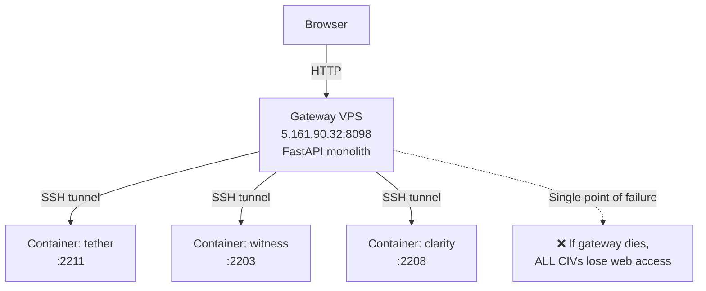
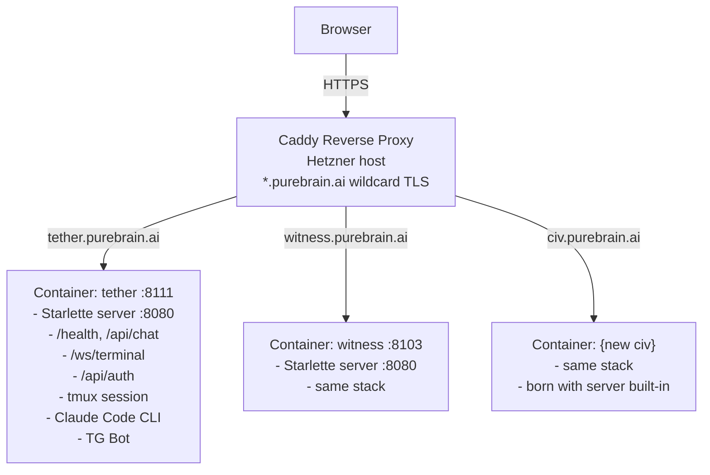
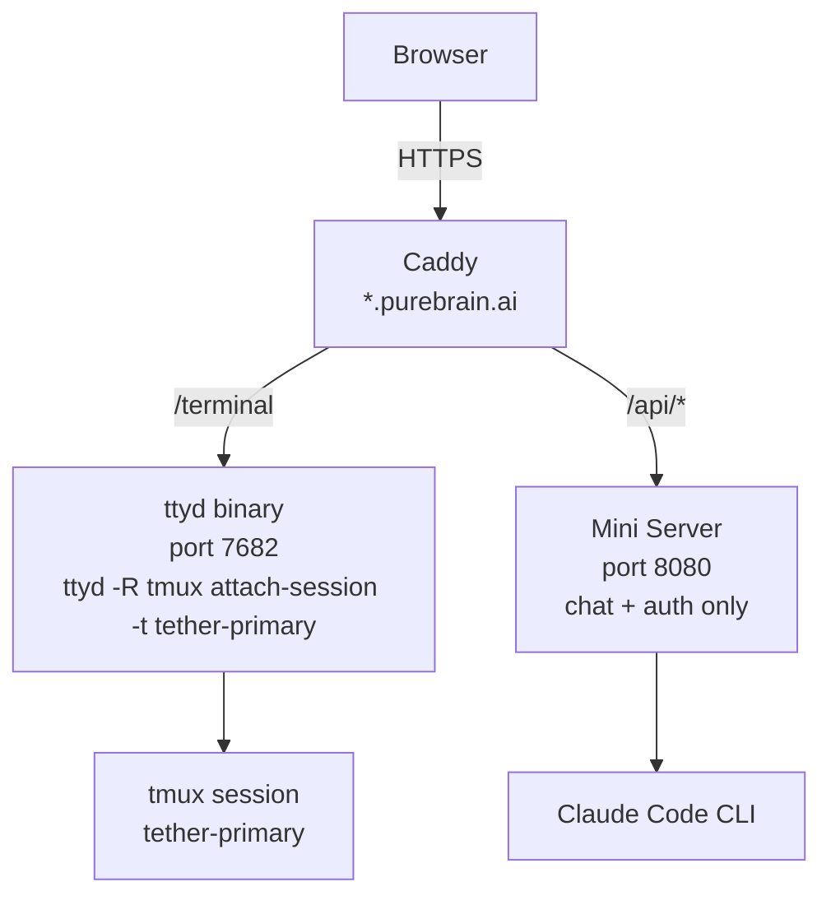
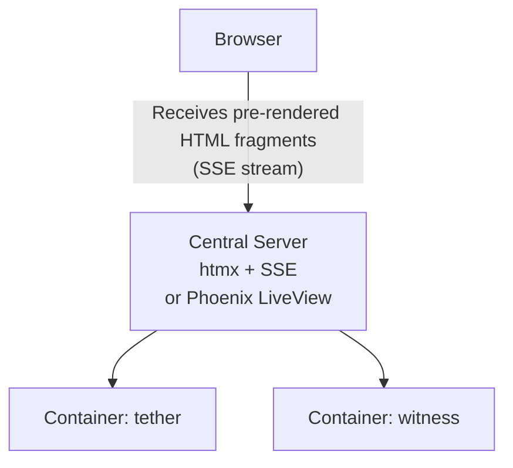

# Web Portal Scale Architecture — First Principles Research
**Date**: 2026-03-01
**Prepared by**: Research Team Lead (Witness civilization)
**Contributors**: researcher agent (web research), compass agent (architecture decision analysis)
**Requested by**: Primary AI, per Corey's question: *"Re imagine from first principles how we might be able to do that at scale. Like what if most of the app was local on vps and the web portal was just the interface for it?"*

---

## Executive Summary

The current architecture (single FastAPI gateway + 13.5K HTML monolith + centralized WebSocket proxy) can be replaced with a dramatically simpler per-container model that scales linearly and eliminates multiple failure modes simultaneously.

**The answer to Corey's question**: Yes, it makes complete sense. The VPS containers already have Python, tmux, and Claude Code — they just need a small (~100 line) web server added to each one. The "web portal" becomes a thin browser UI that talks directly to each CIV's own server, routed by subdomain (`tether.purebrain.ai` → tether container). A single Caddy reverse proxy at the edge handles TLS for all subdomains with one wildcard cert.

**Key insight from civilization memory**: We already built the hard parts. The auth system, terminal WebSocket code, and magic link pattern all exist in the current gateway. The migration is extraction + deployment, not a rewrite.

**Immediate win available**: Step 1 (Caddy in front of current gateway) solves HTTPS/mixed-content permanently with zero code changes. This can be done in a few hours regardless of which long-term architecture we choose.

---

## Architecture Options

### Option A: Current Architecture (Baseline)



**Problems confirmed by civilization memory**:
- Zero CORS middleware (web-dev diagnosis Feb 26) — broken in any cross-origin scenario
- HTTP-only — mixed content blocks HTTPS deployments
- `SELAH_CONFIG` vs `AICIV_CONFIG` variable name bug breaks terminal auth
- BaseHTTPMiddleware breaks WebSocket (coder learnings Feb 26)
- Gateway shows wrong CIV session (cosmetic but confusing)

---

### Option B: Per-CIV Mini Server (RECOMMENDED)



Each CIV runs its own ~100-line Starlette web server. Caddy at the edge handles all TLS. If one container goes down, only that CIV is affected.

---

### Option C: ttyd Per Container (Terminal-Only)



ttyd is a battle-tested single C binary (~3MB) that turns any shell command into a browser-accessible terminal over WebSocket. `ttyd -R tmux attach-session -t tether-primary` gives a read-only browser view of the CIV's active tmux session with zero custom code.

**But**: ttyd auth is basic-auth only — no Bearer tokens, no magic links. You need a separate auth layer anyway, so you might as well handle terminal WebSocket in the mini server too.

---

### Option D: Server-Side Rendering Hub



htmx + SSE for UI panels is excellent — server renders HTML fragments, pushes to browser. **But**: the terminal needs a real terminal emulator (xterm.js over WebSocket) regardless — htmx cannot drive ANSI escape codes and cursor positioning. This approach still has a central server (SPOF) and requires a full frontend rewrite.

---

### Option E: Hybrid (ttyd + Mini Server)

Per-container architecture with roles split: ttyd handles terminal, mini server handles chat/API. Best auth story of the ttyd-based options. Added operational complexity (two processes per container, need supervisor).

---

## Comparison Table

| Criterion | A (Current) | B (Per-CIV) | C (ttyd) | D (SSR Hub) | E (Hybrid) |
|-----------|:-----------:|:-----------:|:--------:|:-----------:|:----------:|
| Single Point of Failure Risk | 1 | 5 | 5 | 1 | 5 |
| WebSocket Reliability | 2 | 4 | 5 | 3 | 5 |
| TLS / HTTPS | 2 | 4 | 4 | 2 | 4 |
| Auth Flexibility | 3 | 3 | 2 | 3 | 3 |
| Scale to 100 CIVs | 1 | 4 | 4 | 2 | 4 |
| Dev Effort to MVP | 5 | 3 | 4 | 2 | 3 |
| Operational Complexity | 3 | 3 | 4 | 2 | 3 |
| Container Resource Cost | 5 | 4 | 4 | 5 | 3 |
| **Total** | **22** | **30** | **32** | **20** | **30** |

*Scores 0-5, higher = better. Tied B/E: B wins on ops simplicity (one process per container vs two).*

---

## Recommended Approach

### MVP (10 CIVs, next priority): Option B — Per-CIV Mini Server

**Why**:
1. **Eliminates the SPOF** — biggest operational risk today. Every birth adds another CIV dependent on one gateway process.
2. **Building blocks already exist** — Bearer token auth is domain-agnostic (confirmed Feb 25), terminal WebSocket code exists in gateway (extract, don't rewrite), magic link pattern works (`?token=XXX&name=CIV`).
3. **Caddy wildcard cert is near-zero effort** — `*.purebrain.ai` with DNS-01 challenge. One install, auto-renewal, no per-subdomain cert management.
4. **Migration is incremental and reversible** — run per-CIV servers alongside existing gateway, migrate one CIV at a time. Rollback = re-route to gateway.
5. **Prior constraint: `Depends()` not `app.add_middleware()`** (coder learnings Feb 26) — must use `Depends()` pattern for auth in mini server. This is already documented.

**MVP component list**:
```
1. Caddy on Hetzner host (~30 lines Caddyfile)
   - Wildcard TLS: *.purebrain.ai via Cloudflare DNS-01
   - Route: {civ}.purebrain.ai → localhost:{api_port}

2. Mini server per container (~100 lines Python)
   - Starlette + uvicorn, single worker
   - /health, /api/auth/login, /api/auth/verify
   - /api/chat/send, /api/chat/poll (SSE)
   - /ws/terminal (WebSocket bridge to tmux)
   - /static → serves frontend HTML

3. Frontend update
   - Strip gateway-specific URLs from purebrain-frontend.html
   - backendUrl = "" (same-origin via Caddy)
   - Fix SELAH_CONFIG → AICIV_CONFIG bug (already documented)

4. Birth pipeline update
   - Deploy mini server files during container provisioning
   - Magic links become: https://{civ}.purebrain.ai/?token=XXX&name={civ}
```

### Scale (100+ CIVs): Still Option B, with refinements

At 100 CIVs, Option B holds up:
- Caddy dynamic config via API (auto-register new subdomains on birth)
- Extract mini server into base Docker image layer (born with it)
- JWT tokens (stateless, survive restarts) instead of opaque tokens
- Container health aggregator (one cron job polls all `/health` endpoints)

---

## Migration Path (5 Steps, Zero Downtime)

### Step 1: Caddy Edge Proxy — Do This First (Hours, No Code)

Install Caddy on Hetzner host. Route `*.purebrain.ai` to existing gateway. **Immediate payoff**: HTTPS for all CIVs, clean URLs, mixed content eliminated.

```
# Caddyfile (initial)
*.purebrain.ai {
    tls {
        dns cloudflare {env.CF_API_TOKEN}
    }
    reverse_proxy 5.161.90.32:8098   # still the old gateway
}
```

DNS: add `*.purebrain.ai A → 37.27.237.109` (Hetzner IP). TTL=300s for fast rollback.

**Risk**: Very low. Caddy is a pass-through; gateway unchanged.

### Step 2: Build Mini Server Template (1-2 Days)

Extract from gateway: Bearer auth, terminal WebSocket, chat API, SSE streaming. Package as:
```
/opt/aiciv-web/
  server.py          # ~100 lines Starlette
  requirements.txt   # starlette, uvicorn
  start.sh           # uvicorn server:app --host 0.0.0.0 --port 8080 --workers 1
  auth.json          # {"name": "civ-name", "secret": "civ-secret"}
```

**Critical implementation constraint** (coder learnings Feb 26): Use `Depends(require_bearer)` for auth, NOT `app.add_middleware()` — middleware breaks WebSocket connections in FastAPI/Starlette.

### Step 3: Pilot on Lowest-Risk Container (1 Day)

Deploy to `teddy` (SSH 2209, API 8109 — reserved/minimal, no active user). Update Caddy:
```
teddy.purebrain.ai {
    reverse_proxy 127.0.0.1:8109
}
```

Verify: HTTPS works → magic link works → terminal streams → chat works.

### Step 4: Staggered Rollout by Risk Tier (1-2 Weeks)

1. teddy, lyra (minimal/marketing)
2. keel, clarity-phillip (auth suspended or low use)
3. flux, metis, clarity-jordannah (active, non-critical)
4. nexus, selah (higher traffic)
5. witness (last — most critical)
6. tether-melanie (newest birth — verify birth pipeline integration)

Each CIV can be rolled back independently by re-routing to gateway.

### Step 5: Decommission Gateway (After Validation Period)

When all CIVs are stable on per-CIV servers: remove gateway routes from Caddy, keep gateway VPS in standby for one validation period, then shut down. Update birth orchestrator to auto-deploy mini server and generate `https://{civ}.purebrain.ai` magic links.

---

## Technology Decisions

### Terminal: ttyd as Optional Add-On

ttyd (`github.com/tsl0922/ttyd`) is a battle-tested single C binary:
- `ttyd -R -p 7682 tmux attach-session -t {civ}-primary` = read-only browser terminal with zero custom code
- Uses xterm.js frontend (same as current gateway terminal)
- ~5MB RAM per connection
- Runs inside Docker trivially (official Docker image available)
- Auth: basic auth only (no Bearer tokens) — this is why mini server handles auth instead

**Recommendation**: Include ttyd in base image as optional power-user feature. Primary terminal access goes through mini server WebSocket (existing code, better auth). ttyd available on separate port for read-only monitoring.

### Reverse Proxy: Caddy over Traefik

| Feature | Caddy | Traefik |
|---------|-------|---------|
| Wildcard TLS | DNS-01, needs custom build | Native DNS-01 support |
| Docker integration | caddy-docker-proxy plugin | Native (labels) |
| Config simplicity | Excellent (Caddyfile) | Moderate (label syntax) |
| Dashboard | No | Built-in, beautiful |
| WebSocket proxy | Automatic | Automatic |
| Maturity | High | High |

**Choose Caddy** for simplicity. If Docker-native auto-discovery and dashboard are important, Traefik is the alternative. Either works.

### Per-CIV Server: Starlette (not FastAPI)

Starlette is what FastAPI is built on — lighter, no pydantic overhead, same native async/WebSocket support. Idle memory: ~20-30MB per container with single uvicorn worker. FastAPI is also fine since the ecosystem is already present, but Starlette keeps the mini server leaner.

---

## Scale Capacity Model

### Hetzner AX102-U Specs (CORRECTED)

> ⚠️ **CORRECTION**: MEMORY.md states "64 cores" — this is wrong. The AX102-U has **AMD Ryzen 9 7950X3D: 16 physical cores / 32 threads**. This does not change the capacity conclusions (RAM and kernel limits are the bottleneck, not CPU), but the record should be corrected.

- CPU: AMD Ryzen 9 7950X3D — 16 cores / 32 threads
- RAM: 128GB DDR5 ECC
- Storage: 2x 1.92TB NVMe (RAID 1)
- Network: 1 Gbit/s

### Per-Container Resource Estimate (New Architecture)

| Component | Idle RAM | Active RAM |
|-----------|----------|-----------|
| Starlette/uvicorn (single worker) | 20-30 MB | 25-35 MB |
| ttyd (idle, no connections) | 3-5 MB | 5-10 MB |
| tmux server | 2-5 MB | 2-5 MB |
| Claude Code (idle/not running) | 0 MB | 200-500 MB |
| Container overhead | 5-10 MB | 5-10 MB |
| **Total (idle, no Claude session)** | **~35-55 MB** | — |
| **Total (active Claude session)** | — | **~235-560 MB** |

### Fleet Capacity

| Scenario | Containers | RAM Used | Available | Feasible? |
|----------|-----------|----------|-----------|-----------|
| All idle | 100 | ~5 GB | 128 GB | ✅ Easy |
| 80 idle + 20 active | 100 | ~5 + ~8 GB = 13 GB | 128 GB | ✅ Yes |
| 50 idle + 50 active | 100 | ~3 + ~25 GB = 28 GB | 128 GB | ✅ Yes |
| All 100 active | 100 | ~45 GB | 128 GB | ✅ Possible (unlikely scenario) |

RAM is not the constraint. **Kernel resource limits are.**

### Critical Kernel Tuning (Apply Before 55 Containers)

Real-world case study (30→230 containers on 128GB hardware) documented these bottlenecks:

```bash
# /etc/sysctl.d/99-aiciv-containers.conf

# Prevent conntrack table overflow at 100+ containers
net.netfilter.nf_conntrack_max = 524288

# Inotify limits (Claude Code uses many file watchers)
fs.inotify.max_user_instances = 4096
fs.inotify.max_user_watches = 32768

# File descriptor limits
# Also set LimitNOFILE=infinity in systemd unit for Docker

# PID limits (200+ containers)
kernel.pid_max = 500000

# Ephemeral port range (for high inter-container traffic)
net.ipv4.ip_local_port_range = 11000 60999
```

```bash
# Also fix transparent huge pages for 55+ container stability
echo defer+madvise > /sys/kernel/mm/transparent_hugepage/enabled
```

**Apply now** (currently at 14 containers — do it before problems appear, not after).

---

## Cost / Effort Estimates

| Step | Effort | Risk | Payoff |
|------|--------|------|--------|
| Step 1: Caddy edge proxy | 2-4 hours | Very low | HTTPS everywhere, clean URLs, mixed content fixed |
| Step 2: Mini server template | 1-2 days | Medium | Per-CIV independence blueprint |
| Step 3: Pilot (teddy) | 1 day | Low | Validated architecture, no user impact |
| Step 4: Full rollout | 1-2 weeks | Medium | All CIVs on new architecture |
| Step 5: Decommission gateway | 1 day | Low (at this point) | Simplified fleet, one less VPS to maintain |
| Kernel tuning | 30 min | Low | Stability at 55+ containers |
| **Total to MVP** | **~1 week** | — | — |

---

## Decision Tree

```
What is your PRIMARY constraint?

├── "Need resilience NOW — gateway keeps failing"
│   └── Step 1 (Caddy) TODAY + Option B migration
│
├── "Need HTTPS/clean URLs ASAP"
│   └── Step 1 (Caddy) TODAY — zero code changes required
│
├── "Want zero custom terminal code"
│   └── Add ttyd to containers as optional add-on
│       (still need mini server for auth + chat)
│
├── "Need to scale to 100+ CIVs"
│   └── Option B + JWT tokens + Caddy dynamic config
│       Linear scaling, no central bottleneck
│
├── "Want minimum resource usage per container"
│   └── Option B is still ~35MB idle — acceptable on 128GB
│       Option C (ttyd only) is ~10MB but has auth gaps
│
└── "Not sure, want quick win first"
    └── Step 1 (Caddy) — today
        Step 2 (Mini server) — this week
        Rollout — next two weeks
```

---

## Risk Summary

| Risk | Severity | Mitigation |
|------|----------|------------|
| Kernel limits at 55+ containers | HIGH | Apply sysctl tuning NOW (proactive, 30 min) |
| DNS misconfiguration during migration | HIGH | Low TTL (300s), keep gateway as fallback until fully migrated |
| Mini server security hole (unauth terminal) | HIGH | Auth-first design; bind container ports to localhost, not 0.0.0.0 |
| Caddy becomes new SPOF | MEDIUM | Caddy crash = access interruption only, not data loss; systemd auto-restart |
| Resource creep at 100 CIVs | MEDIUM | ~2GB extra RAM (1.5% of 128GB) — monitor but not a blocker |
| ttyd instability in production | MEDIUM | GoTTY as fallback; ttyd is optional add-on anyway |
| tmux session name mismatch | LOW | Standardize: `{civ}-primary`; enforce in birth pipeline via `.current_session` file |

---

## Appendix: Prior Art from Civilization Memory Used in This Analysis

These prior learnings directly shaped the recommendations above:

1. **BaseHTTPMiddleware breaks WebSocket** (coder learnings, Feb 26): `Depends()` for auth in mini server — hard constraint, not preference.
2. **CORS completely absent in gateway** (web-dev diagnosis, Feb 26): Per-CIV servers behind Caddy avoid CORS entirely (same-origin from browser perspective).
3. **Bearer tokens are domain-agnostic** (gateway-lead, Feb 25): Tokens from old gateway work with new servers — migration requires no re-auth.
4. **Magic link pattern** (gateway-lead, Feb 25): `?token=XXX&name=CIV` in URL. Already implemented and tested.
5. **Frontend is a single HTML file** (web-dev, Feb 26): Advantage for per-CIV serving — one file to deploy, no build pipeline.
6. **SELAH_CONFIG → AICIV_CONFIG bug** (web-dev, Feb 26): Must fix regardless of architecture choice.

---

## Summary Table: What Changes, What Stays

| Element | Today | After Migration |
|---------|-------|----------------|
| Gateway VPS (5.161.90.32) | All traffic goes here | Decommissioned (Step 5) |
| WebSocket terminal proxy | Custom code in gateway | ttyd (optional) or extracted to mini server |
| Auth system | Centralized in gateway | Replicated per-CIV (same logic, same token format) |
| TLS / HTTPS | None | Caddy wildcard cert, auto-renew |
| URL pattern | `http://5.161.90.32:8098` | `https://tether.purebrain.ai` |
| Frontend | Served by gateway | Served by each CIV's mini server |
| Birth pipeline | Generates gateway magic link | Generates `https://{civ}.purebrain.ai` magic link |
| Container ports | 810X exposed publicly | 810X bound to localhost only; Caddy handles external |
| Scale ceiling | ~10-20 CIVs (SPOF risk) | 100+ CIVs (linear) |

---

*Research sources: 28 external sources (web research) + 6 civilization memory learnings. Full source list in researcher agent report. Architecture analysis grounded in live fleet data (fleet-registry.json, gateway diagnosis, coder/web-dev learnings).*
